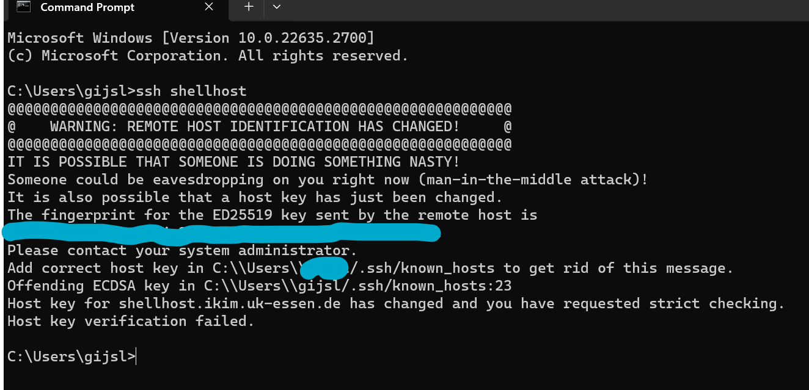

# Setup for windows machines
Perform getting started [Getting Started](https://ikim-essen.github.io/ClusterDocs/getting-started/)
- Read the whole getting started docs!
- You will find your "config", "known_hosts" and "id_ikim.pub" files in C:\Users\username\.ssh

## For Command Line Interface
- Test connection:  ssh ikim
- Login slurm:      ssh shellhost

## For VS code
1. Install the Remote - SSH extension from microsoft.
2. Left button click on the connection sign.
3. Connect to host --> click linux when prompted

## Trouble shooting
- Refused by unkown host or Could not establish connection to shellhost: Port forwarding disabled.
*- Add the following lines to your known_host file*
*shellhost.ikim.uk-essen.de ssh-ed25519 ASK DEVOPS TEAM
shellhost.ikim.uk-essen.de ssh-ed25519 ASK DEVOPS TEAM
shellhost.ikim.uk-essen.de ssh-ed25519 ASK DEVOPS TEAM
shellhost.ikim.uk-essen.de ssh-ed25519 ASK DEVOPS TEAM
shellhost.ikim.uk-essen.de ssh-ed25519 ASK DEVOPS TEAM*
&nbsp;
- The lines you eddit will be changed by the SSH client (unkown cause), causing a blocking warning when login in.

Fix VS code
*1. Workaround, the warning states which line is the problem. Delete this line.*
*The first time you login with VScode it will ask you to retry, retry and from then on it works*

Fix CMD
*2. For the Command line interface fix, go to the config file and on top add "StrictHostKeyChecking no"

