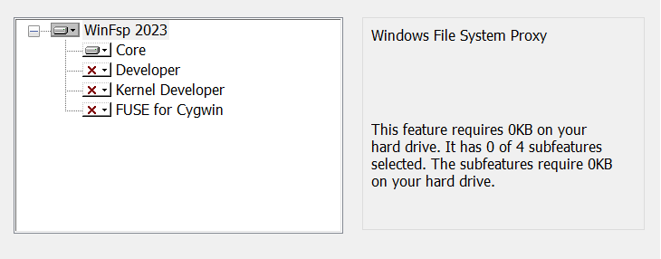
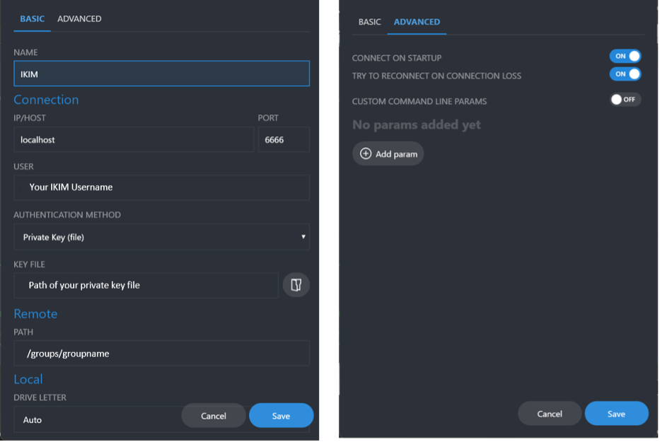
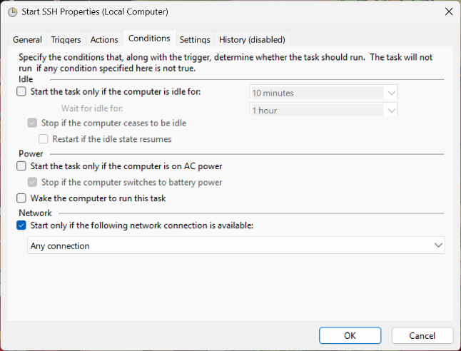
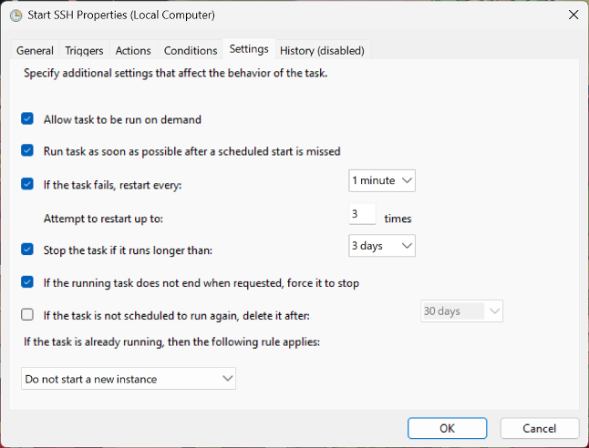
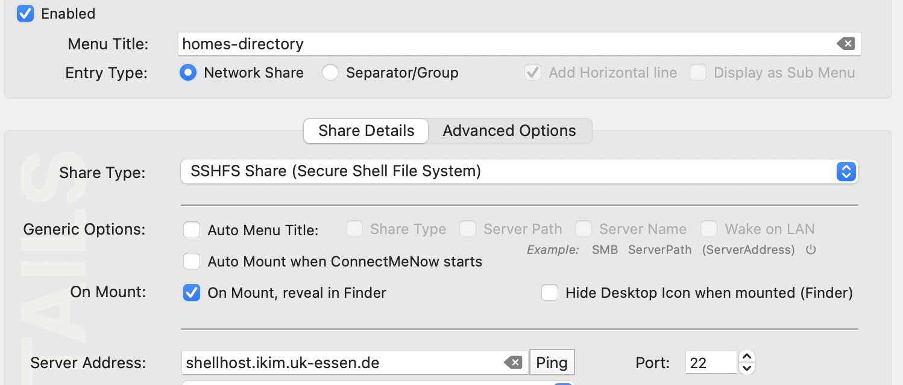
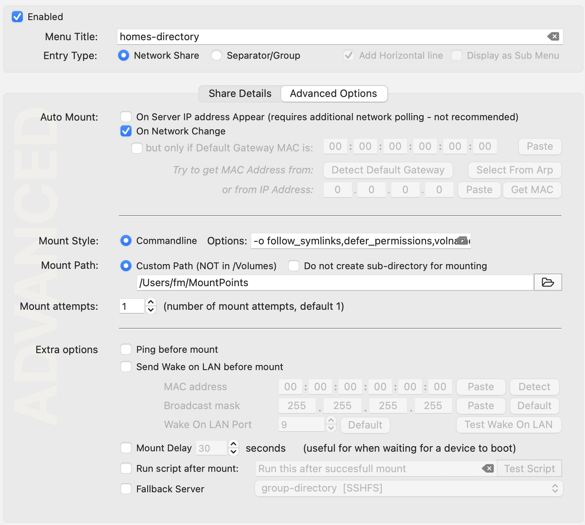

# Accessing cluster storage on Windows and Mac clients

You can access storage on the cluster directly from your laptop (or if need be
from a desktop computer). This is not intended for transferring large amounts
of data, but rather for editing a spreadsheet needed for the next experiment that
is stored on a server in the IKIM network and is mounted to the lab instrument.

Secure access to file server storage in the cluster is available via sshFS.
It is not intended for large file transfer. See [transfer](transfer.md)
for options for large file transfer.

We will first ensure all the bits are in place, test the setup and finally
set your system up to automatically connect to directories on the file servers.

While you can mosly cut-copy-paste, you still
need to replace user, group and project names with your own.

Below is a resonable configuration for a home directory, a group directory
and one project directory.

| name | remote directory | local directory  |  Parameters|
| ---  | --- |  -- | ---|
| Home directory    | /homes/juser/ | /Users/joe/remote/ |`-odefer_permissions,volname=HOMES-DIR`|
| Group directory    | /groups/experts/ | /Users/joe/group/ |`-defer_permissions,volname=GROUPDIR`|
| Project directory | /project/workwithme/ | /Users/joe/project/|`-odefer_permissions,volname=PROJECTDIR`|

Please insert your username, groupname and project name respectively. You can
add more directories if you so desire.

## HowTo for Windows Clients

These instructions assume you are the administrator of your Windows computer and
that it is running the latest fully patched version of Windows.

1. [Download and Install – WinFsp](https://winfsp.dev/rel/)

    Only install the core elements as indicated here

    

2. From the same page, download SSHFS-win(x64) and install

3. Download and install the latest version of

    [SSHFS-win manager](https://github.com/evsar3/sshfs-win-manager)

4. Open a txt file in the .ssh folder (located in the user folder), enter the following,
and save it as a .ps1 file

    ```text
    Start-Process ssh -WindowStyle Hidden -ArgumentList "-fN", "-L", "6666:shellhost.ikim.uk-essen.de:22", "shellhost"
    ```

5. Open SSHFS-win Manager – click on the Add connection button, enter the following, and save

    

6. Open Task Scheduler

7. Select Action > Create Task

7.1 In the General Tab – give a name to the action and select Run with highest privileges


7.2 Under the Trigger tab – click new at the bottom left and select the option in the figure


7.3 Under the Action tab, click new at the bottom left

* Action - Start a Program
* In Program/script: option enter powershell.exe
* In Add Arguments: option enter the following

    ```text
    -ExecutionPolicy Bypass -File "indicate the location of the ps1 file here" 
    ```

7.4 Under Conditions tab



7.5 Under Settings Tab



7.6 Click OK

Your task should be available in the task scheduler library – right click and select run.

Then go to SSHFS-win manager and click the connect button (the round button with the plug and socket).
You should now have the IKIM drive mapped in your file explorer.
Now, the connection should be automatically triggered every time you connect to a network, for example, after restarting.

## HowTo for Mac Clients

We provide a step-by-step guide for setting up secure remote storage access.

1. Install MacFuse and SSHFS:
 Follow the instructions at [MacFuse](https://osxfuse.github.io). Please note that this will require at least one reboot and some level of  attention to details. It should take about 3-5 minutes to complete.

2. Ensure sure that your `~/.ssh/config` file is set up correctly

   Check our [guide](access.md) on setting up the ssh config.

3. Verify your `~/.ssh/config` file
 Note: You will not need to do this to use the storage, but if this does not work, there is
something wrong with your ssh setup.

   ```ssh shellhost```

   If this does not work, please check the guide above.

4. Create an empty directory Mac for temporary purposes

   Open a  Terminal window and type

   ```mkdir ~/remote```

   Or use the Finder to create this directories. (Please note this guide assumes there is not already a file or directory by this name.)

5. Mount your homes directory into your local environment

In your Terminal execute the command below to mount, after replacing "juser" with your own username for the cluster.

   ```sshfs juser@shellhost:/homes/juser $HOME/remote/
    -odefer_permissions,volname=HOMES-DIR```

We supply a volume name (`volname`) to describe the directory, you can modify the name to your liking.

5. check if things work
Type `mount | fgrep ikim` and you should see something link

    ```
    juser@shellhost.ikim.uk-essen.de:/homes/juser on /Users/joe/remote (macfuse, nodev, nosuid, 
synchronous, mounted by juser)
    ```

You are now connected to your home directory on the file server.

You can now either use command line tools like `ls` or use the Mac Finder to browse the directory. But we are not done, if you close your laptop or log out, the network drive will not re-appear. So we need to ensure its available permanently.

6. Remove the temporary bits

Before we automate the setup, we need to clean up.
You can use the Finder to unmount the directory (right-click) and remove the now empty directory that we created earlier.

Or you can type:

    ```
    diskutil unmount force ~/remote
    rmdir ~/remote
    ```

7. Now set up permanent access to the server

    1. Download ConnectMeNow
    Depending on your computer use [Apple Silicon]( https://www.tweaking4all.com/downloads/network/ConnectMeNow4-v4.0.18-macOS-arm64.dmg) or [Intel](https://www.tweaking4all.com/downloads/network/ConnectMeNow4-v4.0.18-macOS-x86-64.dmg) to download the software.

8. Follow [this guide](https://www.tweaking4all.com/software/macosx-software/connectmenow-v4/) on how to use the software to automate mounting.

    1. Ensure you set the following parameters are set for share

        
        * select SSHFS as ShareType
        * set Server Address: `shellhost`
        * set the Path to your homes-directory e.g. `/homes/juser`

    2. Ensure you set the following parameters are set for Advanced Options

        
        * ensure that the menu title makes sense, we suggest using `homes-dir`, etc.
        * ensure that under Advanced settings `Ping before mount` is disabled
        * ensure under MountStyle you use `-o follow_symlinks,defer_permissions,volname=homes-dir`

9. Success.

If everything worked well so far, you should now have set up one or more Share definition in ConnectMeNow. The software will appear as an entry in the menu bar of your Mac like this
.

You have now successfully enabled file secure server access to the server using your existing SSH configuration.

Please note that this is not the correct option to transfer very large files.

10. FAQs

    1. If you experience a permisssion denied response, you forgot the `-odefer_permissions` parameter

    2. ConnectMeNow disappeared, check the menu bar.
