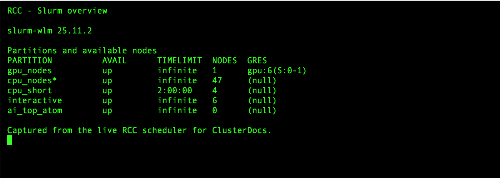

# Class 5: Slurm acceptance patterns

<section class="course-video-hero" id="watch-first">
  <p class="course-video-kicker">Recommended starting point · 3 min video</p>
  <h2>Watch the class first</h2>
  <p>Slurm execution modes, everyday commands, bounded acceptance patterns, GPU selection, and safe scheduler use. Watch the complete lesson, then use the written page below for copyable commands, exercises, and reference details.</p>
  <video controls preload="metadata" playsinline poster="../../assets/video-posters/class5.png" src="{{ media_base_url }}/RCC_Onboarding_Class_5_Video_Enhanced.mp4?v=67c02998">
    <track kind="captions" srclang="en" label="English captions" src="../../assets/captions/RCC_Onboarding_Class_5_Captions.vtt" default>
    Your browser does not support embedded video.
  </video>
</section>

This class adapts the same three patterns used by RCC software acceptance testing, but scales them down for one learner and one tiny job at a time.

## Three execution modes

| Mode | Use it for | Do not use it for |
|---|---|---|
| Short queue (`cpu_short`) | Tests and batch jobs that finish within two hours | Long runners or work that needs a longer limit |
| Interactive (`interactive`) | Attended shells, debugging, notebooks, and Shiny development | Overnight, detached, or unattended computation |
| Regular compute (`cpu_nodes`) | Bounded long-running CPU batch jobs | Interactive sessions kept open while nobody is working |

GPU work follows the same principle: request the current GPU partition in a
batch job and keep interactive GPU exploration attended and bounded.

By the end of Class 5, you should also be able to distinguish a GPU partition,
an exact GPU type, an architecture feature, host memory, and GPU memory. The
GPU-selection lesson is included below rather than presented as a separate
class.

## Everyday Slurm commands

| Task | Command |
|---|---|
| See partition summaries | `sinfo` |
| See your jobs | `squeue --me` |
| Open a bounded worker shell | `srun --partition=interactive --pty --cpus-per-task=1 --mem=1G --time=00:15:00 bash -i` |
| Submit a script | `sbatch job.sbatch` |
| Inspect a job | `scontrol show job <jobid>` |
| Measure a completed job | `sacct -j <jobid> --format=JobID,State,Elapsed,MaxRSS,ExitCode` |
| Stop a job | `scancel <jobid>` |

The following screenshot was captured from the RCC scheduler on 25 July 2026.
It shows what `sinfo` looks like, but the available nodes and partitions can
change. Run `sinfo` yourself before choosing a partition.



A minimal batch script is:

```bash
#!/usr/bin/env bash
#SBATCH --job-name=small-test
#SBATCH --partition=cpu_short
#SBATCH --cpus-per-task=1
#SBATCH --mem=1G
#SBATCH --time=00:10:00

set -euo pipefail
srun python analysis.py
```

Slurm normally allocates the requested CPU, memory, GPU, and time on a suitable
node. It does not give the job an exclusive whole node. Ordinary jobs should
not add `--nodes` or `--exclusive`; request whole or multiple nodes only for a
measured application designed to use them.

## Choosing the right GPU on RCC

> **The default rule:** Use the standard `gpu_nodes` partition and request
> **one GPU without a model** unless your software, memory requirement, or
> reproducibility plan genuinely requires a particular GPU.

RCC does not create one queue for every GPU generation. Ampere, Blackwell, and
future standard GPU systems can share `gpu_nodes` when their scheduling policy
is the same. Slurm selects an exact model through a typed GPU request and an
architecture through a node constraint.

### GPU learning objectives

After this part of Class 5, you can:

- distinguish a partition, GPU type, architecture feature, and system memory;
- discover the user-visible GPU labels without enumerating physical nodes;
- request any available GPU for the shortest practical queue time;
- request an exact GPU type when compatibility or reproducibility requires it;
- select an architecture without inventing a new partition name;
- request GPUs from Snakemake; and
- verify the GPU assigned to a running job.

### Four different concepts

| Concept | RCC/Slurm example | What it controls |
|---|---|---|
| partition | `gpu_nodes` | queue policy, limits, access, and priority |
| typed GPU GRES | `rtx_a6000` | exact consumable GPU model |
| architecture feature | `gpu_arch_ampere` | Boolean hardware capability |
| system memory | `--mem=32G` | host RAM, not GPU VRAM |

Do not create a mental model in which “partition” means “GPU model.” Partitions
exist for policy. Types and features describe hardware.

### See the available labels

This command prints unique GPU resource/feature combinations without showing
physical node names:

```bash
sinfo -h -N -p gpu_nodes -o '%G|%f' | sort -u
```

You may see labels such as:

```text
gpu:rtx_a6000:1|gpu,gpu_arch_ampere,gpu_model_rtx_a6000
```

The exact list can change as hardware is accepted. Copy the type exactly as
published by Slurm and ClusterDocs; do not guess a marketing abbreviation.

RCC currently also has an `ai_top_atom` platform queue with typed GPU `gb10`
and feature `gpu_arch_blackwell`. That queue exists because the ARM64
Grace-Blackwell platform uses a different exclusive-user policy. It is a
policy exception, not the pattern for future Blackwell GPU servers.

### Request any standard GPU

Use this when the application supports all GPUs currently offered in
`gpu_nodes`:

```bash
#!/usr/bin/env bash
#SBATCH --job-name=gpu-any
#SBATCH --partition=gpu_nodes
#SBATCH --gpus-per-node=1
#SBATCH --cpus-per-task=4
#SBATCH --mem=16G
#SBATCH --time=00:10:00
#SBATCH --output=logs/%x-%j.out

set -Eeuo pipefail
nvidia-smi -L
python your_gpu_program.py
```

The bounded copyable version is
[`gpu-any.sbatch`](../classes/examples/gpu-any.sbatch). Submit it with:

```bash
mkdir -p logs
sbatch gpu-any.sbatch
```

This request gives Slurm the largest set of eligible systems and normally
reduces waiting time.

### Request an exact model

Use an exact model when at least one of these is true:

- the working set requires the VRAM available on that model;
- the application or container has been validated only on that model;
- a benchmark must be comparable with earlier runs;
- a numerical or performance result is explicitly hardware-dependent; or
- the application uses model-specific capabilities.

Example for the current standard x86 GPU type:

```bash
#SBATCH --partition=gpu_nodes
#SBATCH --gpus-per-node=rtx_a6000:1
```

The bounded copyable version is
[`gpu-rtx-a6000.sbatch`](../classes/examples/gpu-rtx-a6000.sbatch). The
equivalent command-line form is:

```bash
sbatch --partition=gpu_nodes --gpus-per-node=rtx_a6000:1 gpu-work.sbatch
```

Do not request `rtx_a6000` merely because it is familiar. An untyped request is
more portable and gives the scheduler more choices.

### Request an architecture

Use a constraint when the requirement applies to an architecture family rather
than one exact model:

```bash
#SBATCH --partition=gpu_nodes
#SBATCH --gpus-per-node=1
#SBATCH --constraint=gpu_arch_ampere
```

A future standard Blackwell server with the normal RCC GPU policy would use:

```bash
#SBATCH --partition=gpu_nodes
#SBATCH --gpus-per-node=1
#SBATCH --constraint=gpu_arch_blackwell
```

The second example becomes runnable only when such a node is listed in
`gpu_nodes`. Do not substitute the special `ai_top_atom` queue unless your work
is approved and compatible with that ARM64 platform.

For a soft preference rather than a requirement, advanced users may use:

```bash
sbatch --partition=gpu_nodes --gpus-per-node=1 \
  --prefer=gpu_arch_blackwell gpu-work.sbatch
```

A preference permits fallback; a constraint does not.

### GPU VRAM versus `--mem`

`--mem=32G` requests **system RAM**. It does not reserve 32 GB of GPU memory.
GPU VRAM is a property of the selected GPU type. Select a type only when the
application's measured peak GPU-memory use requires it.

Inside the job:

```bash
nvidia-smi --query-gpu=name,memory.total,memory.used,driver_version \
  --format=csv
```

Measure representative data before launching a large workflow. Out-of-memory
failures should lead to a reviewed resource change, not an automatic retry
storm.

### Apptainer GPU jobs

Slurm allocates the GPU. Apptainer exposes the host NVIDIA driver and devices:

```bash
apptainer exec --nv --cleanenv /approved/images/tool.sif \
  python /work/run_analysis.py
```

The container must not install or replace the host NVIDIA driver. Record the
image digest, GPU type, driver version, and important application versions with
the analysis when hardware-dependent reproducibility matters.

### Snakemake GPU resources

For any standard GPU:

```python
rule gpu_analysis:
    input:
        "data/input.tsv"
    output:
        "results/output.tsv"
    threads: 4
    resources:
        slurm_partition="gpu_nodes",
        gpu=1,
        mem_mb=16000,
        runtime=30
    shell:
        "python workflow/scripts/gpu_analysis.py {input} {output}"
```

For an exact model:

```python
resources:
    slurm_partition="gpu_nodes",
    gpu=1,
    gpu_model="rtx_a6000",
    mem_mb=16000,
    runtime=30
```

For an architecture requirement:

```python
resources:
    slurm_partition="gpu_nodes",
    gpu=1,
    constraint="gpu_arch_ampere",
    mem_mb=16000,
    runtime=30
```

Keep RCC-specific labels in a workflow profile or configuration layer when the
workflow should also run on other clusters.

### Verify the allocation

Inside the job, capture:

```bash
printf 'job=%s node=%s\n' "$SLURM_JOB_ID" "$SLURMD_NODENAME"
printf 'allocated_gpu_ids=%s\n' "${SLURM_JOB_GPUS:-unknown}"
nvidia-smi -L
nvidia-smi --query-gpu=name,uuid,memory.total,driver_version --format=csv
```

After completion:

```bash
sacct -j JOB_ID \
  --format=JobID,State,Elapsed,AllocTRES,ReqTRES,MaxRSS,ExitCode
```

Retain this information for performance studies and hardware-sensitive
analyses.

### Why a GPU job is pending

Use the reason Slurm gives you:

```bash
squeue -j JOB_ID -o '%.18i %.9T %.40R'
```

Common interpretations:

| Reason | Meaning |
|---|---|
| `Resources` | matching GPUs are busy |
| `Priority` | other eligible jobs currently rank ahead |
| `QOS...` or `Assoc...` | an account/QOS limit applies |
| `ReqNodeNotAvail` | required hardware is unavailable or drained |

A typed model or architecture constraint deliberately reduces the eligible
pool. Remove it only when the application can genuinely run on other GPUs.

### GPU decision checklist

Use **any GPU** when:

- the application supports all published standard GPU types;
- the dataset fits on all standard GPUs; and
- exact hardware is not part of the scientific comparison.

Use an **exact type** when:

- measured VRAM requirements demand it;
- validated software compatibility is model-specific; or
- reproducibility requires the same model.

Use an **architecture constraint** when:

- compiled kernels or capabilities require the architecture family; and
- more than one model in that architecture would be acceptable.

Use a **special partition** only when RCC documents a policy/platform reason.
Never invent `gpu_ampere`, `gpu_blackwell`, or a model-specific queue name.

### GPU completion exercise

1. Run `sinfo -h -N -p gpu_nodes -o '%G|%f' | sort -u`.
2. Submit the bounded “any GPU” example.
3. Record the assigned model and total VRAM.
4. Submit the typed example only if `rtx_a6000` remains published.
5. Explain which request gives Slurm more placement choices and why.

## Pattern 1: Bash hello

The first job verifies scheduling, environment capture, output handling and exact comparison.

```bash
bash exercises/slurm/run-gate.sh bash
```

## Pattern 2: Snakemake inside an allocation

The second job runs a minimal local Snakemake workflow. It does not download packages or contact external services.

```bash
bash exercises/slurm/run-gate.sh snakemake
```

## Pattern 3: Apptainer inside an allocation

The third job uses an instructor-provided, immutable training image:

```bash
export RCC_TRAINING_IMAGE=/approved/path/to/training-image.sif
bash exercises/slurm/run-gate.sh apptainer
```

## Built-in availability protection

The gate:

- submits only one job at a time;
- uses one CPU, 128 MiB RAM and a two-minute limit;
- refuses job arrays;
- refuses to run when another learner gate is active for the same user;
- waits for a bounded period;
- compares output byte-for-byte;
- cleans only its own temporary directory;
- does not enumerate nodes or expose scheduler configuration.

## What the examples prove

A passing class gate shows that your account can execute the pattern. It is not a cluster-wide health test and must not be expanded into host-by-host probing.

> **Reference companion:** After completing the bounded gates, use the
> [Slurm command reference](../reference/slurm.md) for dependencies, reusable
> allocations, GPU requests, accounting, cancellation, and checkpointing.

## Knowledge check

<details><summary>Why compare output byte-for-byte?</summary>

It detects small, unexpected changes and makes the gate deterministic.
</details>

<details><summary>Why not run all examples in parallel?</summary>

Parallelism is unnecessary for a learner gate and creates avoidable load and harder-to-understand failures.
</details>
