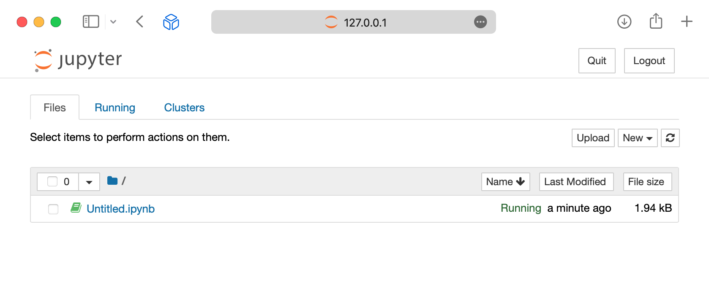
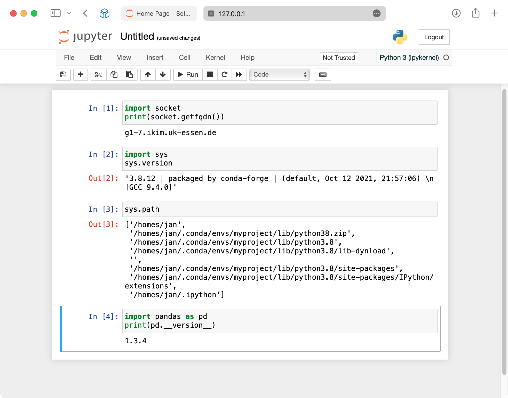

# Class 9: Python notebooks for large datasets

<section class="course-video-hero" id="watch-first">
  <p class="course-video-kicker">Recommended starting point · 4 min video</p>
  <h2>Watch the class first</h2>
  <p>Safe Jupyter access, large-data patterns, Python tools, reproducibility, and responsible AI exploration. The video shows the current SSH-tunnel workflow; the written guidance below also records the planned RCC Analysis Notebook path.</p>
  <video controls preload="metadata" playsinline poster="../../assets/video-posters/class9.png" src="{{ media_base_url }}/RCC_Onboarding_Class_9_Video_Enhanced.mp4?v=345e66d3">
    <track kind="captions" srclang="en" label="English captions" src="../../assets/captions/RCC_Onboarding_Class_9_Captions.vtt" default>
    Your browser does not support embedded video.
  </video>
</section>

This class teaches safe interactive Python analysis on RCC. A notebook is useful
for inspection, statistics, figures, and prototyping. It is **not** the place to
hide an overnight production workflow, reserve resources indefinitely, or repeat
the same manual analysis across a large cohort.

## Product transition: Jupyter becomes the primary browser interface

RCC is moving toward **RCC Analysis -> Notebook** as the normal interactive
analysis experience. That planned path starts Jupyter inside a bounded Slurm
allocation and brokers the browser connection for you.

When released, a normal notebook user should not need to:

- enroll an SSH key;
- select a worker hostname;
- submit `sbatch` manually;
- create an SSH tunnel;
- copy a Jupyter token; or
- expose a notebook port.

Until RCC Analysis Notebook is explicitly enabled on the RCC landing page, the
manual Slurm + SSH-tunnel procedure below remains the supported current path.
After browser notebooks are released, the manual route remains useful as an
advanced/fallback technique rather than the default onboarding experience.

## Learning goals

After this class, you can:

- explain why a Jupyter kernel is a real scheduled workload;
- use the current Slurm/tunnel notebook path safely;
- understand the planned browser-first RCC Analysis Notebook path;
- inspect a large dataset by sampling and summarising instead of loading
  everything blindly;
- choose between pandas, Polars, DuckDB, Arrow, NumPy, SciPy, and Matplotlib;
- measure memory/runtime and use GPUs only when measurement supports them; and
- move repeated or expensive work from a notebook into a governed workflow.

## Before you start

For the **current manual notebook path**, complete the Class 1 SSH gate and the
Class 5 Slurm gate. You need a working SSH client, a valid RCC account, and the
ability to submit one small Slurm job.

For the **future browser-first path**, the goal is different: an authorized RCC
account/project and browser authentication are sufficient. SSH is optional.

## The RCC notebook rule

A notebook kernel is a normal process. It consumes CPU, memory, local scratch,
and sometimes a GPU. Therefore substantial notebook computation must run in a
bounded Slurm allocation whether RCC creates that allocation for you or you
submit it manually.

### Current manual path

```bash
cp -a examples/interactive-workflows/jupyter my-jupyter-session
cd my-jupyter-session
sbatch jupyter.sbatch
```

Read the job output file. It shows the worker, selected loopback port, and tunnel
command. Open only the local address shown by the tunnel. Do not bind a notebook
to a public interface and do not disable the token.

The current connection sequence is:

1. submit the Jupyter job;
2. wait for the job to report worker, loopback port, token, and tunnel;
3. run that tunnel command on your workstation;
4. open the local `127.0.0.1` address; and
5. stop the Slurm job with `scancel <jobid>` when finished.

### Planned RCC Analysis Notebook path

```text
Files: choose/upload project data
        -> RCC Analysis: Notebook
        -> choose project + modest notebook profile
        -> Open notebook
        -> save durable work in the project
        -> stop notebook / automatic idle reclamation
```

The Slurm allocation still exists, but RCC owns the scheduler and browser-attach
details.

## What the current local notebook view looks like

These screenshots come from the earlier ClusterDocs Jupyter walkthrough. They
show the classic Notebook interface rather than the future RCC Analysis browser
shell, but they preserve useful visual checks for the current manual route: the
browser address is local `127.0.0.1`, and code executes in the remote allocated
environment.





Do not reuse those values: former worker hostnames, home paths, usernames, ports,
or tokens from screenshots. Never publish a notebook token or include it in a
support screenshot.

## Large-data pattern

Use this sequence before writing a full analysis:

1. Describe the question in one sentence.
2. Inspect the file size and format.
3. Load a small sample or a small set of columns.
4. Summarise groups before plotting.
5. Check memory and runtime.
6. Save a small reproducible notebook.
7. Decide whether the full-scale work belongs in RCC Analysis Workflow / a
   current Slurm workflow instead of the notebook.

For tabular data, prefer columnar or chunked access. CSV is portable, but slow
for repeated analysis. Parquet, Arrow, DuckDB, or an indexed database table are
usually better for repeated interactive work.

## Copyable example

The course includes:

- `examples/interactive-workflows/notebooks/python-large-data.ipynb`
- `examples/interactive-workflows/python/analysis.py`
- `examples/interactive-workflows/python/python.sbatch`
- `examples/interactive-workflows/python/environment.yml`

The notebooks use synthetic data so that you can practice safely. Their
RiboSnake-inspired section builds a Bray--Curtis PCoA and a ranked waterfall
plot in both Python and R. Committed notebook outputs stay empty so that results
or restricted data cannot be published accidentally.

## Python tool choices

| Task | Suggested tool | Notes |
|---|---|---|
| Small to medium tables | pandas | Good default for teaching and quick work. |
| Larger local tables | Polars or DuckDB | Useful when memory becomes tight. |
| Numerical arrays | NumPy | Keep arrays typed and avoid unnecessary copies. |
| Statistics | SciPy, statsmodels | Record versions and assumptions. |
| Static plots | Matplotlib | Reliable for publication-oriented figures. |
| Interactive exploration | Notebook widgets sparingly | Avoid building long-running web apps in a notebook. |

## AI and data science techniques

Use notebooks to inspect data, establish baselines, compare techniques, and
explain results. Move full training, large hyperparameter searches, embedding
generation, repeated inference, and production analyses into bounded workflows.

A reviewable machine-learning workflow includes:

- data-quality and missingness checks;
- a subject-safe or time-safe train/validation/test split;
- preprocessing and feature engineering inside the versioned pipeline;
- a simple baseline;
- an evaluation measure chosen before tuning;
- calibration, uncertainty, subgroup behavior, and leakage checks;
- fixed seeds where deterministic behavior is possible; and
- versioned code, environment, parameters, metrics, and model artifacts.

Use GPUs only when the framework and measured workload benefit. A GPU is not a
“make notebook faster” switch. For larger-than-memory tables, try column
selection, Parquet, Arrow, DuckDB, Polars, and chunked processing before
introducing distributed computation.

## Resource patterns RCC should discourage

Interactive notebooks are especially prone to accidental over-requesting. Avoid:

- many CPUs for mostly single-threaded code;
- large memory allocations “just in case”;
- GPU allocations with negligible GPU use;
- keeping a notebook allocation open while away from the browser;
- repeating the same notebook manually across samples; and
- using an interactive notebook to orchestrate thousands of tiny tasks.

The preferred progression is:

```text
Notebook -> measure -> right-size -> Workflow when repeated/scalable
```

RCC may recommend resource changes from aggregate scheduler/accounting evidence
without inspecting notebook content, filenames, commands, or research data.

## Good security and reproducibility habits

- Do not paste patient identifiers, tokens, private keys, or passwords into notebooks.
- Do not commit notebook outputs containing restricted data.
- Keep notebooks small enough that another person can review the reasoning.
- Put package versions in `environment.yml` or another reviewed environment definition.
- Use project membership rather than sharing another user account.
- Save durable outputs in project storage.
- Stop the current manual Slurm notebook job when finished; future browser
  notebooks should also be subject to idle reclamation.

## Completion gate

Run the local structure check before using the example on RCC:

```bash
python3 exercises/interactive/validate-interactive-examples.py
```

For the current manual route, start one Jupyter job and confirm:

1. the notebook binds to `127.0.0.1`;
2. you can connect through the SSH tunnel; and
3. you can stop the job with `scancel`.

Do not run more than one notebook job for this class.

When RCC Analysis Notebook is released, the acceptance gate changes: a user with
no SSH key enrolled must be able to open a project notebook from the browser,
produce a small durable result, stop/reconnect safely, and retrieve the result in
Files without facilitator shell intervention.

## Self-check questions

1. Why is a notebook kernel a Slurm workload even when the browser hides Slurm?
2. Why is a sampled plot safer than loading every row at once?
3. What should move from a notebook into a workflow?
4. Why should notebook listeners never become uncontrolled public services?
5. When is a GPU notebook justified?
6. Which notebook data must never be committed or pasted into support channels?
