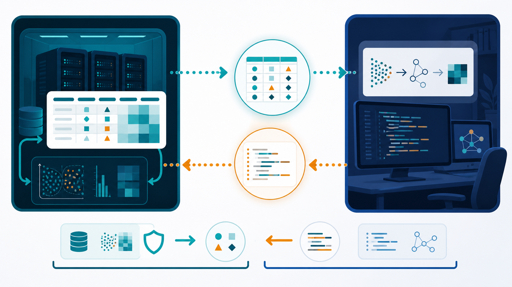

# Class 18: use a coding agent without sharing your real data

You have data in RCC and want a **coding agent**—an AI tool that writes, tests,
and revises code—to build the analysis. This class shows the simplest safe
pattern for an **off-site coding agent**.

> **RCC rule:** never make real or pseudonymised RCC research data available to
> an off-site coding agent. Health and genetic data are specially protected
> under German and EU law. A service subscription, institutional licence, or
> generic claim that a tool is “approved” is not authorization to disclose RCC
> data. This class uses fully invented data only.

> **Five-minute video proposed:** the matching narration and six-scene plan are
> prepared for review. The written walkthrough below is complete and usable
> now; no video is being presented as released yet.

<figure>
  
  <figcaption>The coding agent sees invented example data. The returned code is reviewed and runs against the real data only inside RCC.</figcaption>
</figure>

## The proposed fast path

This should take three choices, not a privacy project:

1. choose a file in your RCC project;
2. describe the table, plot, or report you want; and
3. click **Make coding example**.

RCC creates a ready-to-upload ZIP containing invented example data, the
question, the expected output, and a bounded prompt. For ordinary tabular data,
there is no form and no case-by-case approval.

If the format contains free text, images, genomic records, exact dates, or
another pattern the generator cannot handle safely, it offers **Use inside
RCC**. The user can continue with an approved RCC/local coding agent without
exporting the data. Only unusual cases should need support.

## The whole idea in one picture

```text
choose file + describe result + Make coding example
        |
        +--> RCC makes a tiny example with invented values
                    |
                    +--> off-site coding agent writes general code
                                      |
                                      +--> code returns to RCC
                                                   |
                                                   +--> real analysis runs in RCC
```

The coding agent needs to see the **shape of the problem**, not the real people or
measurements.

## 1. What the button creates

The user should not have to assemble the bundle manually. **Make coding example**
creates:

```text
CODING_AGENT_REQUEST/
├── QUESTION.md
├── example.csv
└── EXPECTED_OUTPUT.md
```

The downloadable [example bundle](../classes/examples/coding-agent-sample/README.md)
shows what the proposed service produces. Until the service exists, the same
small bundle can be created manually without copying any real row.

### QUESTION.md

Describe the result in ordinary language:

```text
Compare measurement_a between group_a and group_b.
Make one summary table and one clear plot.
The real input is a CSV file with the same columns as example.csv.
```

Do not include project names, patient details, filenames copied from the real
dataset, or a real error message that contains values.

### example.csv

Use the same column names and broad data types only when those names are safe to
share. Invent every value from scratch:

```csv
sample_id,group,age_band,measurement_a,passed_qc
SYN-001,group_a,40-49,12.4,true
SYN-002,group_a,50-59,11.8,true
SYN-003,group_b,40-49,18.1,false
SYN-004,group_b,50-59,17.6,true
```

`SYN-001` is not a replacement for a real patient ID. The entire row is made
up. The numbers are illustrative, not noisy versions of real measurements.

## 2. Do not “scramble” real rows

These shortcuts are not a safe export:

- shuffling the rows;
- hashing or numbering patient IDs;
- swapping values between patients;
- changing names but retaining dates, locations, diagnoses, or free text;
- copying rare categories or unusual combinations; or
- pasting the first ten real rows and asking the coding agent to ignore them.

Such data may still describe identifiable people. Pseudonymised data that can
be linked back to a person remains personal data. **Make coding example** avoids
these shortcuts. If it cannot safely create a fixture, choose **Use inside RCC**
and continue without exporting the data.

## 3. Give the off-site coding agent a bounded request

Copy this prompt and attach only the invented files:

```text
The attached CSV is entirely synthetic. Write a small, reproducible analysis
for a real CSV with the same columns.

Requirements:
- accept --input and --output command-line arguments;
- never contact a network service;
- never modify the input file;
- validate required columns and explain errors without printing row data;
- save the analysis code, a summary CSV, one plot, and a short run log;
- list required Python packages with versions;
- do not hard-code values from the synthetic rows;
- include a command that tests the code on example.csv.

Explain the plan first. Then provide the files and exact test command.
```

If the coding agent asks for real values, provide another invented edge case
instead. For example, add a synthetic missing value or a deliberately empty
group.

## 4. Bring the code back to RCC

Create a new folder in the project for the proposed code. Keep the downloaded
files separate from the real data while you inspect them.

Check that the code:

- reads the input path you provide;
- writes only to the output path you provide;
- does not contain network calls, credentials, or hidden upload code;
- does not delete or overwrite input data;
- has bounded CPU, memory, and time requirements; and
- records package versions and the command used.

Run it on `example.csv` first. Compare the output with `EXPECTED_OUTPUT.md`.

## 5. Run the real analysis inside RCC

After review, point the same code at the real project input **inside RCC**. Use
an RCC worker for substantial computation. Store code, logs, plots, tables, and
the final report in the project.

Do not send real outputs back to the off-site coding agent unless those outputs
have separately been approved for external use. An error message can also leak
filenames, values, or sample identifiers; make a short synthetic reproduction
instead.

## Three-point completion check

You have completed the course when:

- you shared only the bundle created by **Make coding example**;
- the returned code passed on that example inside RCC; and
- the real data and real analysis outputs stayed inside RCC.

RCC performs the detailed fixture checks automatically. The user sees a clear
green result or the **Use inside RCC** alternative, not a long approval form.

This workflow helps with writing code. It is not a claim that a dataset has
been legally anonymised, and it does not replace project-specific approval.

For the legal and operational boundary, read [off-site coding agents must not
receive RCC research data](../concepts/how-rcc-works.md).
