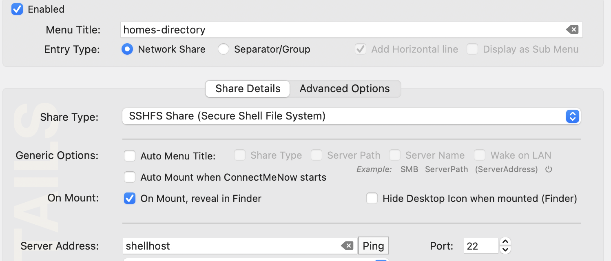
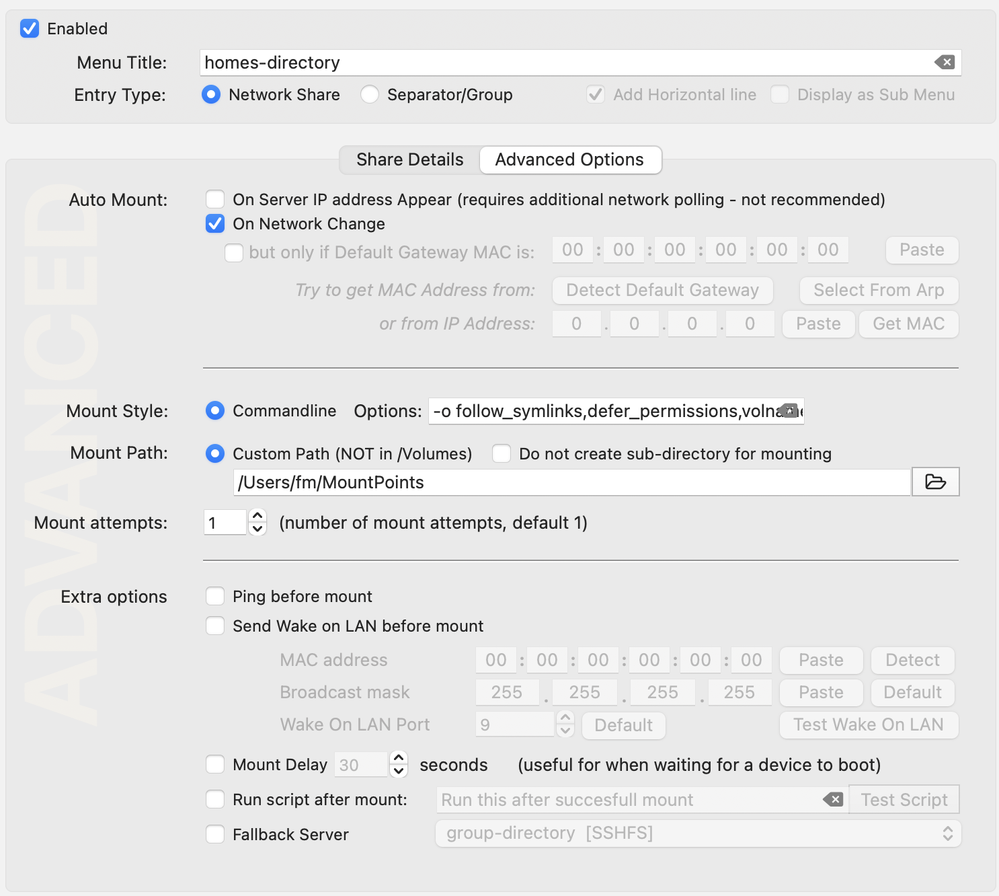
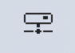

# Legacy macOS access to RCC storage

> **Legacy convenience path:** This preserves the historical ClusterDocs macOS
> SSHFS workflow. Use it only to understand or migrate an existing
> setup—not as current endpoint guidance or for bulk instrument transfer.

The historical setup used macFUSE, SSHFS, a jump-host SSH configuration, a
local mount directory, and optionally ConnectMeNow.

The old documentation referred to `login.ikim.uk-essen.de` and `shellhost`.
These may not represent the current RCC production path.

## Historical SSH configuration

```sshconfig
Host ikim
    HostName login.ikim.uk-essen.de
    User <RCC-USERNAME>
    IdentityFile ~/.ssh/id_ikim

Host shellhost
    HostName shellhost.ikim.uk-essen.de
    User <RCC-USERNAME>
    IdentityFile ~/.ssh/id_ikim
    ProxyJump ikim
```

Use [Account access, SSH, and VS Code](../reference/access-ssh-vscode.md) for
the current RCC configuration and key policy.

## Historical manual mount

Test SSH:

```bash
ssh shellhost
```

Create a mount point:

```bash
mkdir -p "$HOME/remote"
```

Mount the historical home path:

```bash
sshfs <RCC-USERNAME>@shellhost:/homes/<RCC-USERNAME> \
  "$HOME/remote" \
  -odefer_permissions,volname=HOMES-DIR
```

Unmount:

```bash
diskutil unmount force "$HOME/remote"
rmdir "$HOME/remote"
```

Current macFUSE and SSHFS versions may use different security and unmount
procedures.

## Historical ConnectMeNow settings

- share type: SSHFS;
- server: `shellhost`;
- path: `/homes/<username>`;
- ping before mount: disabled;
- mount options similar to:

```text
-o follow_symlinks,defer_permissions,volname=homes-dir
```

This is retained so existing Mac configurations can be understood and migrated.

### Historical ConnectMeNow screenshots

> **Use these to recognize an old setup, not to create a current one.** The
> screenshots preserve the earlier ClusterDocs walkthrough at its original
> resolution. The visible `shellhost` alias, home-directory target, mount path,
> and automatic network-change behavior are historical.

The share screen selected SSHFS and pointed ConnectMeNow at the former server
alias:



The advanced screen configured command-line mount options and disabled ping
before mount:



After configuration, ConnectMeNow appeared as a small network-drive icon in the
macOS menu bar:



For a new setup, use the current RCC alias, a project directory rather than an
authoritative research dataset in home storage, and manual mount/unmount tests
before considering automation.

## Appropriate use

Use the mount to inspect a report, edit a small sample sheet, copy a small
configuration file, or browse completed results.

Do not use it for complete Illumina runs, active Nanopore output, Ardia data,
tiled microscopy acquisitions, analysis, or high-volume random I/O.

Before troubleshooting SSHFS, verify the current RCC SSH path. Never include
private keys, passwords, or patient-related filenames in support requests.

Return to [Choosing an instrument-data transfer path](instrument-data-options.md)
before selecting a current transfer method.
