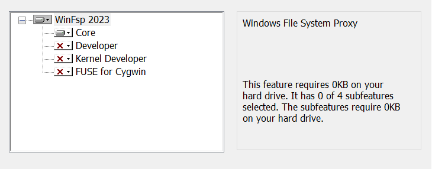
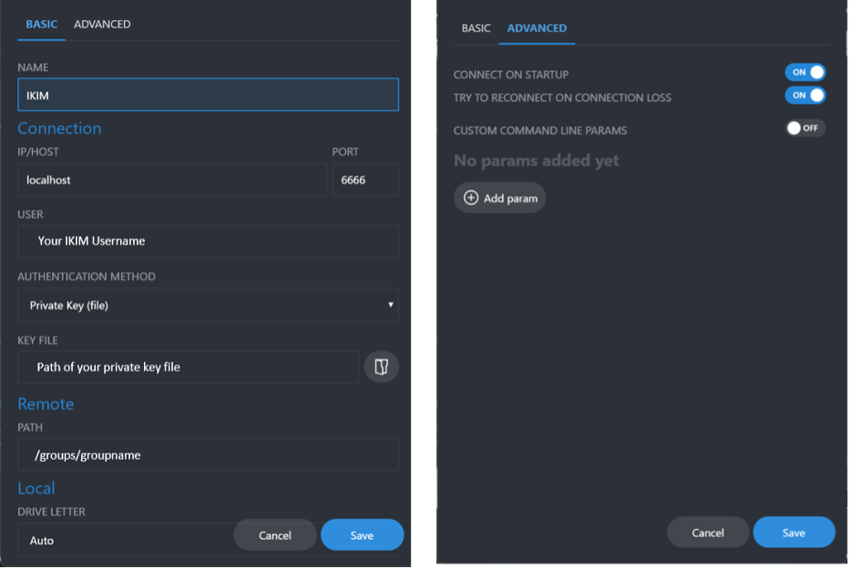
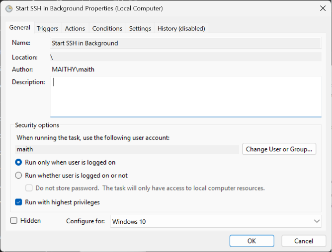
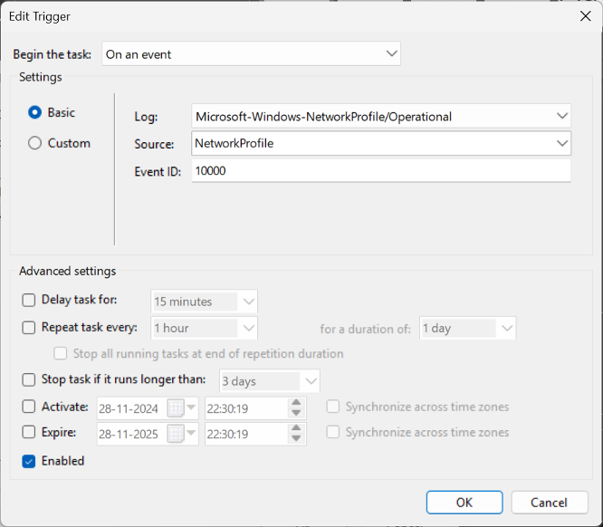
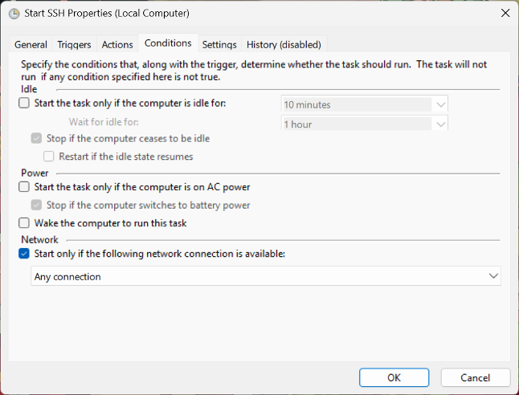
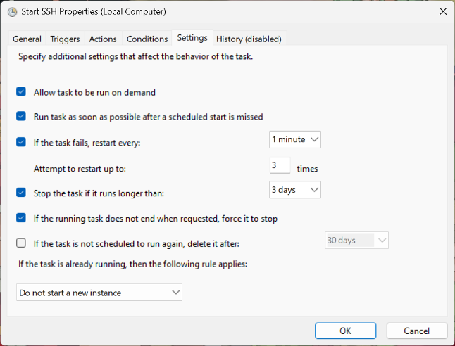

# Legacy Windows access to RCC storage

> **Legacy convenience path:** This preserves the historical ClusterDocs
> Windows SSHFS workflow. Use it only to understand or migrate an existing
> setup—not as current endpoint guidance or for bulk instrument transfer.

The historical setup used WinFsp, SSHFS-Win, SSHFS-Win Manager, an SSH tunnel,
and optionally Windows Task Scheduler.

The old documentation used `login.ikim.uk-essen.de`, `shellhost`, and local port
`6666`. These describe the former environment and may not be current RCC
production endpoints.

## Historical SSH configuration

Location:

```text
C:\Users\<WINDOWS-USERNAME>\.ssh\config
```

Pattern:

```sshconfig
Host ikim
    HostName login.ikim.uk-essen.de
    User <RCC-USERNAME>
    IdentityFile ~/.ssh/id_ikim

Host shellhost
    HostName shellhost.ikim.uk-essen.de
    User <RCC-USERNAME>
    IdentityFile ~/.ssh/id_ikim
    ProxyJump ikim
```

Do not reuse this unchanged. Obtain the current RCC configuration and key
instructions from [Account access, SSH, and VS Code](../reference/access-ssh-vscode.md).

## Historical tunnel

```powershell
Start-Process ssh -WindowStyle Hidden `
  -ArgumentList "-fN", "-L", `
  "6666:shellhost.ikim.uk-essen.de:22", "shellhost"
```

The SSHFS-Win Manager connection used the forwarded local port.

## Historical installation sequence

1. Install a supported WinFsp release.
2. Install a compatible SSHFS-Win release.
3. Install SSHFS-Win Manager.
4. Configure and test SSH.
5. Add the SSHFS connection.
6. Optionally use Task Scheduler to start the tunnel.
7. Test with a small non-sensitive file.

Historical remote path patterns were `/homes/<username>/`, `/groups/<group>/`,
and `/project/<project>/`. Current RCC paths may differ.

### Historical visual walkthrough

> **Read the current text before using these images.** The screenshots are
> retained from the earlier ClusterDocs site because they help identify an
> existing installation. Product versions, aliases, paths, port `6666`, and
> automation choices shown below are historical and are not current RCC
> configuration values.

The WinFsp installer selected the core filesystem component rather than the
developer components:



The SSHFS-Win Manager example used a local forwarded connection and a group
path. Do not copy its localhost port, key path, remote path, or automatic-start
choice into a new setup:



The former optional automation used Windows Task Scheduler. These screenshots
are retained so an existing task can be recognized and removed or migrated:









Do not create an unattended background tunnel merely because it appears in the
old walkthrough. First confirm the current endpoint, host identity, credential
handling, need for automatic mounting, and safe stop behavior with RCC.

## Appropriate use

Use the mount to inspect a report, edit a small text file, copy a sample sheet,
or browse completed results.

Do not use it for complete sequencing runs, live Nanopore output, Ardia exports,
large microscopy datasets, analysis, or hundreds of thousands of files.

Prefer the current RCC transfer portal, SFTP service, server-to-server transfer,
or facility-managed ingestion for instrument data.

Return to [Choosing an instrument-data transfer path](instrument-data-options.md)
before selecting a current transfer method.
