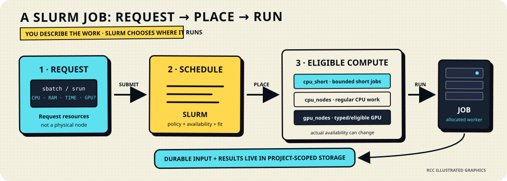

# RCC Journey

RCC Journey is the science-first way to understand and trust the computational
process without turning every researcher into a systems, workflow, or container
engineer.

**Science first. Reproduce what matters. Compute as little as you can get away
with.**

<section class="expedition-callout" aria-labelledby="journey-title">
  <p class="expedition-kicker">One RCC trust model · two ways to explore it</p>
  <h2 id="journey-title">Straight to the point or show me around</h2>
  <p>Both Journey modes use the same questions, evidence, RCC assistance promises, and public-safe boundary. Light is concise. Playful keeps the longer technical-comic catalogue, richer diagrams, and machine-room rabbit holes.</p>
  <div class="expedition-actions">
    <a class="expedition-primary" href="#journey-light">Journey Light →</a>
    <a href="#journey-playful">Playful Journey →</a>
    <a href="getting-started/migration-assistant.md">Migrating from the old cluster? →</a>
  </div>
  <p class="expedition-privacy">No scoring. No leaderboard. “I do not know” is a valid answer when RCC can measure, infer, or help instead.</p>
</section>

## The shared Journey contract

```text
RCC JOURNEY
    │
    ▼
● you bring the science and the analysis you already have
○ RCC asks only what changes execution, reproducibility, or safety
○ “why RCC asks” links the evidence when strong evidence maps cleanly
○ RCC AI removes workflow/environment/container engineering where possible
○ explicit artifacts and tests verify what AI proposed
○ RCC runs and measures what actually happened
    │
    ▼
TRUSTWORTHY RESULT + EXECUTION EVIDENCE
```

The process-marker grammar is shared with newer RCC email and illustrated status
material:

- `●` established, complete, or already true;
- `○` current, available next, or still to be completed;
- `×` blocked, stopped, or unavailable; and
- `!` explicit attention or caution.

The markers are intentionally compact enough to remain useful in a narrow email,
a browser status strip, a diagram, or plain text.

<section class="path-grid" aria-label="Choose an RCC Journey mode">
  <article class="path-card analysis-path" id="journey-light">
    <span class="path-number">01</span>
    <p class="path-label">Journey Light</p>
    <h3>Understand why RCC asks, then get on with the science</h3>
    <p>A short evidence-backed trust path. Each question is paired with <strong>Why RCC asks</strong> and <strong>RCC can help</strong>. The current core covers existing scripts/notebooks, workflow shape, rerun requirements, software environments, data boundaries, and resource sizing.</p>
    <p><strong>Best for:</strong> researchers who want the model quickly and do not want a computing course.</p>
  </article>
  <article class="path-card development-path" id="journey-playful">
    <span class="path-number">02</span>
    <p class="path-label">Playful Journey</p>
    <h3>The same trust model with more computing rabbit holes</h3>
    <p>Retains the longer prototype catalogue: I/O shape, node-local scratch, GPU fit and memory, instrument-to-result paths, endpoint trust, coding-agent boundaries, right-sizing, and the optional machine-room reveal.</p>
    <p><strong>Best for:</strong> curious users who enjoy diagrams, technical-comic explanations, and seeing what happens underneath.</p>
  </article>
</section>

## Why the evidence morsels exist

The evidence is not a quiz and not decoration. A morsel answers the implicit
question **“why are you asking me this?”**

Examples in the current governed catalogue include:

- a biomedical code-sharing study where 50.1% of the sampled papers did not
  share analytical code;
- the Stodden, Seiler, and Ma computational-reproducibility study, where the
  findings were reproduced for 26% of the full 204-paper sample;
- Nature's 2016 survey in which more than 70% of respondents reported a failed
  attempt to reproduce another scientist's experiment;
- the large biomedical Jupyter-notebook rerun study, where 5.56% of attempted
  notebooks both ran and reproduced the recorded result identically; and
- a Slurm resource-prediction study built from roughly 17.6 million historical
  jobs, used here to support the idea that exact memory/runtime estimation is a
  systems problem worth helping with rather than a skill every scientist should
  be expected to master.

The cards preserve the scope of each source. Journey must not turn a memorable
study-specific number into a universal claim about science.

## RCC AI assistant: remove engineering work, not scientific control

A central Journey promise is that existing scientific work is enough to start.
The intended assistant path is:

```text
existing script / notebook / commands
             │
             ▼
○ dependency discovery
○ Conda environment + locked versions
○ reproducible container
○ Snakemake or Nextflow where a workflow helps
○ validation + provenance
○ RCC execution + measured resource use
             │
             ▼
● explicit, inspectable execution package
```

The scientist should not have to write Snakemake, Nextflow, environment, or
container definitions merely to make existing work reproducible. AI may propose
those artifacts; the artifacts, tests, parameters, container identity, and
measured execution remain authoritative.

## Playful depth: how RCC actually places work

The playful mode can descend into the machinery without making that machinery a
prerequisite for ordinary use.



The point of the figure is not to teach node names. It is to make the service
contract visible: **you describe the work; Slurm chooses an eligible place to
run it; durable data stays with the project.**

## Relationship to ClusterDocs and RCC Expedition

- **ClusterDocs** is the source of truth for mutable RCC instructions and service
  state.
- **RCC Journey Light** explains the trust model quickly.
- **Playful Journey** adds curiosity, computing intuition, and physical depth.
- **RCC Expedition** remains the guided hands-on path for users who actively want
  workstation/Linux/SSH/Slurm training.
- **Migration Assistant** is for experienced users carrying old-cluster habits
  into the new project/browser/workflow model.

Journey is optional. Trust in RCC should come from a visible process and
inspectable evidence, not from requiring everyone to complete the same course.
