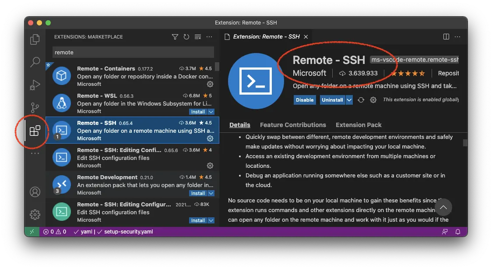
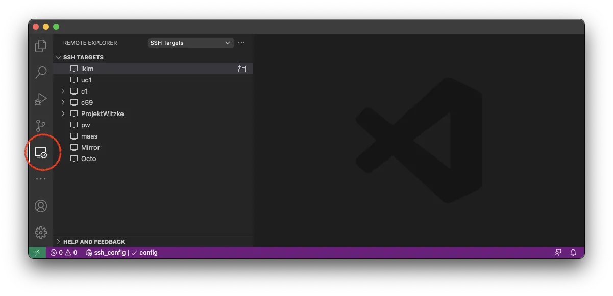
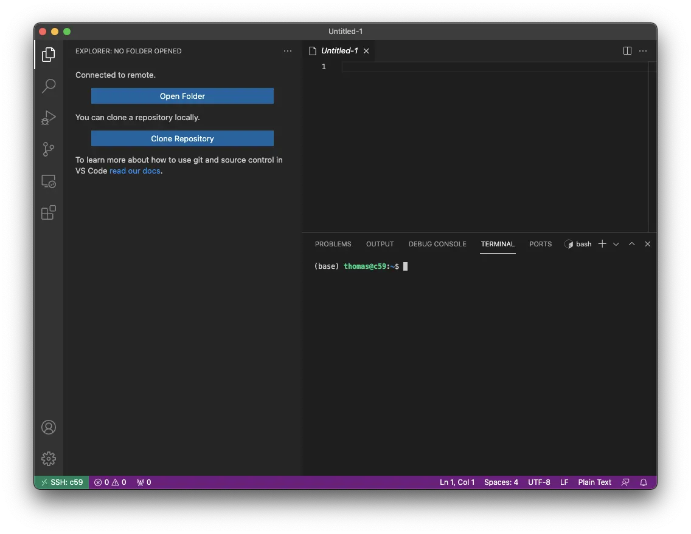

# Account access, SSH, and VS Code reference

This guide collects the practical setup details from the earlier ClusterDocs
site. Complete [Class 1](../course/class-01-safe-access.md) first so that the
credential and host-verification rules are clear.

> **Recommended for most users:** use **VS Code with Remote - SSH** as your
> everyday interface for writing code, editing configuration, using Git,
> reading logs, and preparing analyses. Use the RCC transfer service for large
> data movement, and submit computation through Slurm. Opening a remote VS Code
> window does not create a compute allocation.

## Request an RCC account

**RCC Admin is ready now**, including self-administration and the
primary-approver workflow. Use RCC Admin for the account or membership request.
If your project uses a coordinated onboarding process, prepare the following
for the responsible project coordinator and primary approver:

- first and last name;
- institutional email address;
- project or working group;
- sponsor or project lead; and
- the **public** SSH key, never the private key.

Every researcher receives an individual account. Project membership replaces
shared accounts and shared credentials.

Every user also has exactly one primary group. Internal users are assigned to
their organizational group; external users are assigned to `collab`. The
primary group records affiliation, while explicit project memberships grant
access to the shared spaces where users from different groups exchange data.
See [Users, groups, and projects](users-groups-projects.md) for the complete
model.

## Create an SSH key

Where a compatible FIDO2 authenticator is available, prefer a hardware-backed key. Its private material remains on the authenticator and normally requires user presence:

```bash
ssh-keygen -t ed25519-sk -f ~/.ssh/id_rcc
```

Otherwise, create the dedicated software-backed Ed25519 key described below. Do not copy either type of private credential between computers.

### macOS and Linux

Create a dedicated Ed25519 key and protect it with a strong passphrase:

```bash
ssh-keygen -t ed25519 -f ~/.ssh/id_rcc
```

This creates two files:

- `~/.ssh/id_rcc` is the private key. Keep it on your workstation and never
  send or paste it anywhere.
- `~/.ssh/id_rcc.pub` is the public key. This is the file RCC registers.

Show the public key when you need to copy it:

```bash
cat ~/.ssh/id_rcc.pub
```

### Windows

Current Windows releases provide the OpenSSH client as an optional feature.
Open PowerShell and check it first:

```powershell
ssh -V
ssh-keygen -t ed25519 -f "$HOME\.ssh\id_rcc"
```

If `ssh` is unavailable, install the Microsoft OpenSSH Client optional feature
using the official Windows instructions. The private and public files are
normally stored under `C:\Users\<username>\.ssh\`.

## Configure the approved RCC target

Use the current host block supplied through a trusted institutional channel.
`{{ ssh_gateway_alias }}` is the forwarding gateway and
`{{ ssh_target_alias }}` is the normal user destination. A safe client
configuration has this shape:

```sshconfig
Host {{ ssh_gateway_alias }}
  HostName VALUE_FROM_THE_APPROVED_RCC_CONFIGURATION
  User YOUR_RCC_USERNAME
  IdentityFile ~/.ssh/id_rcc
  IdentitiesOnly yes
  ForwardAgent no

Host {{ ssh_target_alias }} c? c?? c??? d?? g?-? g?-??
  HostName %h.ikim.uk-essen.de
  User YOUR_RCC_USERNAME
  IdentityFile ~/.ssh/id_rcc
  IdentitiesOnly yes
  ProxyJump {{ ssh_gateway_alias }}
  ForwardAgent no
```

Use `{{ ssh_target_alias }}` for normal login and VS Code. The node patterns
are for a node assigned by an active Slurm interactive allocation, not for
selecting arbitrary compute capacity. The `{{ ssh_gateway_alias }}` account is
forwarding-only and will not provide an interactive shell. Do not use
`ssh {{ ssh_gateway_alias }}` as a login test or try to start a second SSH
connection there; `ProxyJump` uses it automatically.

Do not copy an old hostname from a colleague, disable host-key checking or
enable agent forwarding merely to make a connection work. Verify the published
RCC host identity through an independent institutional channel.

Inspect the effective configuration without connecting:

```bash
ssh -G {{ ssh_target_alias }}
```

Then use the bounded readiness test from Class 1. For manual diagnostics, one
verbose connection attempt is usually enough:

```bash
ssh -v {{ ssh_target_alias }}
```

Remove key material, usernames, local paths, and tokens before sharing a debug
log with support.

Do not approve an unexpected SSH identity warning and do not delete host
records merely to make the warning disappear. Close the client, compare the
configuration and host identity with the current RCC instructions, and contact
RCC support if they do not match.

## Use VS Code Remote SSH as the main working interface

1. Install Visual Studio Code and Microsoft's **Remote - SSH** extension.
2. Confirm terminal SSH works first.
3. Open **Remote Explorer** and select the approved RCC alias from the SSH targets.
4. Open only the project or source directory you need.
5. Keep data, environment, cache, and generated-result directories out of
   workspace-wide search.

Use VS Code for the work it does well:

- edit Python, R, shell, Snakemake, configuration, and documentation files;
- review Git changes before committing them;
- use the integrated terminal for navigation, small checks, and Slurm commands;
- inspect job logs and small result summaries; and
- work with a narrowly scoped project folder.

Do not use the editor terminal for sustained analysis on the submission host.
Do not drag large datasets through the file explorer, and do not open a home,
group, or whole project storage root merely to browse it.

### Find the controls shown in ClusterDocs

The screenshots below show where the main VS Code controls are. Interface
details can move between versions. Do not copy target names, usernames, or
server labels from a screenshot; select the RCC connection you were given.

Install Microsoft's Remote - SSH extension from the Extensions view:



Open Remote Explorer and select the approved target. The screenshot contains
example personal entries; do not copy them:



After connecting, use **Open Folder** to choose only the project or source tree
needed for the task:



Do not manually accept an unexpected identity warning in VS Code. Close it,
run the current RCC connection test, and contact RCC support if the warning
remains.

## Customize VS Code without creating performance problems

VS Code uses `rg` for full-text search and watches workspace files for changes.
A recursive search or watcher over shared data, Conda environments, package
trees, workflow caches, or generated results can create substantial CPU,
network, and filesystem metadata load. This was one of the most important
practical warnings in the earlier ClusterDocs.

Start by opening the smallest useful folder, usually the repository containing
your code. Put directories that should never be searched in `.gitignore` or
`.ignore`, for example:

```gitignore
.venv/
.snakemake/
data/
results/
node_modules/
```

For a large project, open **Preferences: Open Workspace Settings (JSON)** and
add reviewed workspace settings such as:

```json
{
  "search.followSymlinks": false,
  "search.useIgnoreFiles": true,
  "search.exclude": {
    "**/.venv/**": true,
    "**/.snakemake/**": true,
    "**/node_modules/**": true,
    "**/data/**": true,
    "**/results/**": true
  },
  "files.watcherExclude": {
    "**/.git/objects/**": true,
    "**/.venv/**": true,
    "**/.snakemake/**": true,
    "**/node_modules/**": true,
    "**/data/**": true,
    "**/results/**": true
  }
}
```

Adapt the names to your repository. Excluding a directory from search or file
watching does not change its permissions and does not make its contents safe to
publish. The old “exclude everything” setting is useful only as an emergency
diagnostic; a small workspace plus precise exclusions is a better default.

Use **Files: Exclude** only to reduce visual clutter. It hides matching paths
from the Explorer but does not prevent code, terminals, extensions, or other
tools from reading them.

### Extensions, workspace trust, and settings

- Install only extensions you need, check the publisher, and keep them updated.
- Notice whether an extension is installed **locally** or **in the SSH remote**.
  A remote extension can execute code and read files with your RCC account's
  permissions.
- Review an unfamiliar repository before granting Workspace Trust. Repository
  tasks, debug configurations, notebooks, and workspace settings may execute
  commands or influence tools.
- Keep passwords, tokens, private keys, patient identifiers, and internal
  service details out of `settings.json`, `.vscode/`, tasks, launch files, and
  extension configuration.
- Commit useful team settings only after review. Prefer a short
  `.vscode/extensions.json` recommendation list over automatic installation of
  a large extension collection.
- Do not enable SSH agent forwarding or bypass a host-identity warning to make
  Remote - SSH connect.

### Analysis and notebooks

VS Code is still the suggested front end for most Python and R users: edit the
analysis, environment file, batch script, and notebook there. The execution
rule does not change. Long or data-intensive Python and R programs run through
Slurm. A Jupyter kernel also runs inside a bounded Slurm allocation and is
reached through the documented loopback tunnel; do not let a notebook or an
interactive editor kernel run sustained work on the submission host.

For debugging, reproduce the issue with a tiny input in a short allocation.
Do not attach a debugger to another user's process or expose a debug port on a
public interface.

## End a session cleanly

Close remote editors and terminals when finished. Interactive analysis,
notebooks, and long-running commands belong in bounded Slurm jobs; they should
not depend on a laptop connection remaining open.

## Mount a small remote folder

Prefer the RCC files portal for browser-based access to approved project
folders. SSHFS is appropriate only for light interactive use such as editing a
small document. It is not a bulk-transfer or analysis filesystem.

After installing a maintained SSHFS implementation for your operating system,
create an empty mount point and use the configured RCC alias:

```bash
mkdir -p "$HOME/rcc-project"
sshfs {{ ssh_target_alias }}:/projects/<project> "$HOME/rcc-project" \
  -o reconnect,ServerAliveInterval=15,ServerAliveCountMax=3
```

Unmount before sleeping the computer or changing networks. The exact unmount
command depends on the operating system and SSHFS package. Do not enable an
unattended automatic mount until manual mount and unmount work reliably.

Avoid opening large directory trees in Finder, Explorer, indexing services,
backup tools, antivirus scanners, or VS Code through SSHFS. Use the
[storage and transfer reference](storage-transfer.md) for larger transfers.
