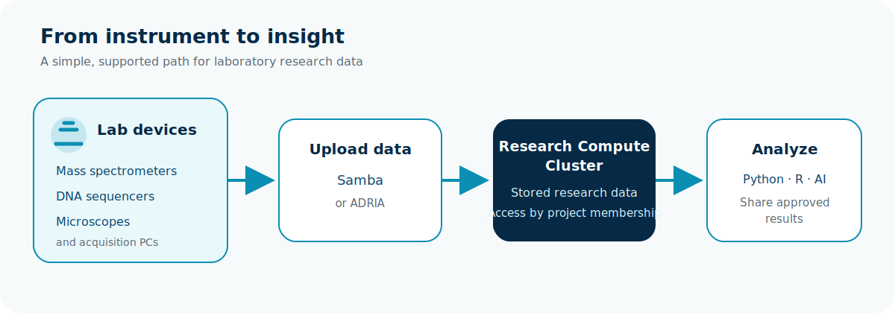

# How RCC and the lab network work together

Research data often begins on an instrument rather than on the cluster. The
**Lab network** provides a controlled way to connect suitable devices and move
their output into storage in the **Research Compute Cluster (RCC)**.

## What can connect?

The Lab network can support many research instruments and their acquisition
workstations. Examples include:

- **Mass spectrometers**, including LC–MS and other mass-spectrometry systems;
- **DNA sequencers**, including short-read and long-read instruments;
- **Microscopes**, including widefield, confocal, live-cell, slide-scanning,
  and electron microscopy systems;
- **Flow cytometers and cell sorters**;
- **Plate readers and imaging systems**; and
- other instruments that produce research files through a supported network
  interface or acquisition workstation.

These are examples, not an automatic approval list. The RCC team checks each
device, data flow, ownership model, and support requirement before connection.

## The simple data journey

1. A registered instrument or acquisition workstation connects to the Lab
   network.
2. It uploads data through an approved **Samba project share** or shared tooling
   such as **ADRIA**.
3. The files are stored in the Research Compute Cluster. Access remains limited
   according to RCC project membership.
4. Researchers analyse the data with Slurm, Python, R, notebooks, AI, or another
   approved workflow and share results through the project's approved route.

Verify that an upload completed before deleting the instrument copy. Use a
checksum when the source system supports one.

## Choose an upload method

### Samba

Samba is a good fit when an instrument or its acquisition workstation can save
to an SMB network folder. It presents RCC storage as a familiar shared folder
and keeps access aligned with project membership. Current connection and
share names are supplied during onboarding.

### ADRIA or another shared tool

ADRIA, or another supported shared acquisition tool, may be a better fit when
it already collects output from the device, adds workflow context, or manages
delivery into the correct RCC storage location.

During onboarding, agree on the target project, file naming, metadata,
checksums, retention, expected volume, and responsibility for failed or partial
uploads.

## Plan the connection before plugging in

Contact the team in the **Mattermost IKIM Cluster channel** with:

- the device type, owner, and physical location;
- its network interface identifier;
- expected data volume and upload frequency;
- software-update or external-access requirements;
- the target RCC project; and
- the preferred transfer method, if known.

The team will confirm whether Samba, ADRIA, or another supported pattern is the
best fit. Do not connect an unmanaged switch, wireless access point, router, or
unregistered device, and do not guess network or proxy settings.

## Technical details

### Network boundary

The Lab network is an **unrouted Layer 2 enclave**. A connected device does not
receive a general routed path into RCC, the hospital network, or the Internet.
The enclave provides only explicit services:

- **DHCP** supplies network configuration. Receiving an address does not grant
  access to RCC data or projects.
- The **HTTP proxy** provides controlled outbound web access for devices that
  support an explicit proxy, for example to retrieve an approved update. It is
  not a general Internet route and does not make the device reachable from
  outside the enclave.
- **Samba** and shared tooling such as **ADRIA** provide approved data-transfer
  paths. They are service bridges, not general network routes.

Layer 2 connectivity does not make a device trusted. Every instrument still
needs an owner, an approved use, appropriate configuration, and a supported
transfer route.

### Samba access boundary

RCC Samba project shares follow the RCC project model:

- a share is published only for a project that has Samba access enabled;
- access is limited to authenticated members of that project;
- guest access is disabled;
- files are stored in RCC and inherit project group permissions; and
- the same data can be used by approved RCC workflows.

Do not store an RCC password in an instrument configuration unless that exact
credential arrangement has been approved. Where possible, upload from a
maintained acquisition workstation using an individually attributable account.

For storage choices and verification commands, continue with
[Storage and transfer](../reference/storage-transfer.md). For project and data
eligibility, see [Biomedical data admission](../security/rcc-biomedical-data-admission.md).
