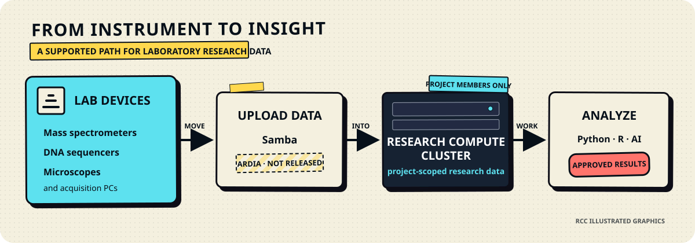

# Lab network: properties, limits, and remote access

Research data often begins on an instrument rather than on the cluster. The
**Lab network** provides a controlled way to connect suitable devices and move
their output into storage in the **Research Compute Cluster (RCC)**.

> **Service status:** project Samba shares are **ready now** for approved
> projects and registered devices. Ardia-to-RCC integration is **not yet
> released**. RCC-to-Coscine transfer is also **not yet released**.



## What can connect?

The Lab network can support many research instruments and their acquisition
workstations. Examples include:

- **Mass spectrometers**, including LC–MS and other mass-spectrometry systems;
- **DNA sequencers**, including short-read and long-read instruments;
- **Microscopes**, including widefield, confocal, live-cell, slide-scanning,
  and electron microscopy systems;
- **Flow cytometers and cell sorters**;
- **Plate readers and imaging systems**; and
- other instruments that produce research files through a supported network
  interface or acquisition workstation.

These are examples, not an automatic approval list. The RCC team checks each
device, data flow, ownership model, and support requirement before connection.

## Protection without general Internet exposure

Connecting an approved device to the Lab network is an option when an
instrument or acquisition workstation needs RCC data services but should not
remain directly connected to the Internet.

The Lab network reduces exposure by removing general direct Internet
connectivity. A registered device does not receive an ordinary routed path to
the Internet, RCC, or the hospital network. Instead, it receives only the
connections approved for its role:

- **Direct access to explicit server endpoints or services**, such as an
  approved Samba project share or another released acquisition service. Ardia
  integration is not yet released. Access to one approved endpoint does not
  grant access to other RCC projects or servers.
- **Limited outbound web access through the Lab-network HTTP proxy** when the
  device supports an explicit proxy and the use has been approved. This can
  support needs such as retrieving vendor or operating-system updates without
  giving the device unrestricted direct Internet routing.
- **No unsolicited inbound Internet access.** Using the proxy does not publish
  the instrument to the Internet or make it reachable from outside the
  enclave.

This is exposure reduction, not automatic trust. The device still needs a
named owner, supported software, timely updates, approved credentials, a
documented data flow, and a response plan. The RCC team must review required
vendor cloud access, remote support, licensing, update URLs, and direct server
dependencies before connection; some products may not be compatible with the
Lab-network model.

## Why the network works this way

Instrument-control computers are unusually difficult to secure. A vendor may
require an old operating system, a fixed driver, an unsupported browser, or a
software version that cannot be changed without invalidating the instrument's
support or validation. Replacing that computer may also be far more disruptive
than replacing an ordinary office workstation.

The Lab network is a compensating control for that reality. It reduces the
number of systems that can contact the device and the number of places the
device can contact. In particular, **there is no direct incoming access from
the Internet**. This removes an entire class of scanning, password guessing,
remote-service exploitation, and accidental publication problems. Limited
outbound access can still be provided for an approved update or licensing flow.

```text
Internet -------------------------X----------------> instrument
approved update site -> HTTP proxy -> outbound request and reply
approved RCC service <-----------> explicitly allowed data path
approved operator -> private tunnel -> PiKVM -> keyboard/video/power console
```

Isolation does not repair an old operating system or make vulnerable software
safe. Owners still need inventory, physical protection, unique credentials,
backups, vendor coordination, incident contacts, and a replacement plan.

## Properties and limitations at a glance

| Property | What it means for a device owner |
|---|---|
| Registered devices only | RCC records the device, owner, interface identifier, purpose, and target project before connection. |
| DHCP configuration | Use the network settings supplied automatically unless RCC has documented an exception. Do not invent a static address, router, or DNS server. |
| No general default route | Ordinary Internet, hospital-network, and arbitrary RCC destinations are not reachable directly. |
| Explicit service paths | Ready Samba shares, or another released project-ingestion service, are reachable only when RCC has approved that exact flow. Ardia is not yet released. |
| Explicit HTTP proxy | Approved outbound web requests can use the proxy settings shown on the Lab-network information page. Software that cannot use the proxy may not be able to update or license itself. |
| No direct incoming connection | Internet port forwarding, public remote desktop, and direct vendor callbacks are not available. |
| Project-scoped data access | Reaching one share or ingestion service does not grant access to other projects. |
| Broadcast discovery may stop at the enclave | Consumer-style discovery, arbitrary multicast, and services that assume a flat routed network may not work. |

These limitations are intentional. If a vendor requires unrestricted inbound
remote support, a broad destination list, a public cloud relay, or a VPN agent,
RCC must review the requirement before the device is connected. Do not work
around a failed connection by adding a router, hotspot, second network cable,
personal tunnel, or unregistered wireless adapter.

## Configure a device from the Lab-network information page

When a registered device is connected, the Lab-network information page is the
source for the values to use now. It may appear automatically as a captive
page. If it does not, open an ordinary HTTP page so the browser can display the
network notice, or contact RCC. Do not copy a proxy address, share name, or
server value from a screenshot or another instrument.

Use the page and the onboarding record to confirm:

1. the device is registered and the recorded owner is correct;
2. address configuration is set to DHCP unless an exception is documented;
3. the current HTTP proxy address and port, if proxy access is approved;
4. the exact approved RCC service, share, or ingestion destination;
5. whether the vendor's update and licensing URLs have been approved;
6. the support contact and change window; and
7. a small connectivity and transfer test before routine acquisition begins.

The public ClusterDocs page deliberately does not reproduce internal proxy,
address, share, or server values. Keeping those values on the live information
page avoids teaching users a configuration that becomes wrong after a service
change. A support screenshot must remove device identifiers, addresses,
credentials, license information, and project names.

## The simple data journey

1. A registered instrument or acquisition workstation connects to the Lab
   network.
2. It uploads data through an approved, ready **Samba project share**. The
   alternative **Ardia** integration is not yet released.
3. The files are stored in the Research Compute Cluster. Access remains limited
   according to RCC project membership.
4. Researchers analyse the data with Slurm, Python, R, notebooks, AI, or another
   approved workflow and share results through the project's approved route.

Verify that an upload completed before deleting the instrument copy. Use a
checksum when the source system supports one.

## Choose an upload method

### Samba

Samba is a good fit when an instrument or its acquisition workstation can save
to an SMB network folder. It presents RCC storage as a familiar shared folder
and keeps access aligned with project membership. Current connection and
share names are supplied during onboarding.

### Future Ardia integration

> **Not yet released:** do not configure or rely on an Ardia-to-RCC route yet.

When released, Ardia may be a better fit when it already collects output from
the device, adds workflow context, or manages delivery into the correct RCC
storage location.

During onboarding, agree on the target project, file naming, metadata,
checksums, retention, expected volume, and responsibility for failed or partial
uploads.

## Plan the connection before plugging in

Contact the team in the **Mattermost IKIM Cluster channel** with:

- the device type, owner, and physical location;
- its network interface identifier;
- expected data volume and upload frequency;
- software-update or external-access requirements;
- the target RCC project; and
- the preferred transfer method, if known.

The team can onboard the ready Samba path or explain whether another released
pattern fits. Ardia remains future work. Do not connect an unmanaged switch,
wireless access point, router, or unregistered device, and do not guess network
or proxy settings.

## Remote console option: Raspberry Pi and PiKVM

A Raspberry Pi running **PiKVM** can provide keyboard, video, mouse, and—when
the hardware is wired for it—power-button control for an instrument workstation.
Unlike ordinary remote desktop, it can remain useful while the workstation is
booting, showing firmware messages, or unable to start its operating system.
That makes it a practical option for supported remote recovery and vendor
sessions without enabling direct incoming access to the instrument computer.

PiKVM is a privileged management device, not a harmless accessory. Anyone who
controls it may be able to view the screen, type commands, attach virtual media,
or power-cycle the target. Onboarding therefore requires:

- a separate registered device record, owner, physical location, and purpose;
- approval for the console and any power-control wiring;
- both factory passwords changed before connection;
- only required services enabled, with the web terminal disabled when it is
  not needed;
- named access, short sessions, logout after use, and 2FA where appropriate;
- maintained PiKVM software and a physical recovery path before remote updates;
- no public port forwarding, public DNS exposure, or direct Internet listener;
  and
- an incident and access-removal process when ownership or vendor support
  changes.

The [PiKVM authentication guide](https://docs.pikvm.org/auth/) documents the
separate Linux and web-interface credentials, 2FA, and session controls.

### Planned private tunnelling with RCC Headscale

> **Not yet released:** do not enroll a workstation or PiKVM device until RCC
> announces the service and supplies a one-time enrollment through the approved
> institutional channel.

RCC is preparing an institutionally operated Headscale coordination service for
approved PiKVM access. Headscale replaces the hosted Tailscale control plane in
this workflow. PiKVM devices and administrator computers still use a
Tailscale-compatible client, configured to connect to RCC Headscale rather than
to a personal hosted-service account.

The design keeps the PiKVM interface off the public Internet. It first attempts
a direct encrypted connection. Where the firewall or NAT prevents that, an
RCC-operated relay carries already encrypted traffic. The tunnel grants access
only to approved management services; it is not a route into the Lab network or
the wider RCC infrastructure.

Read the dedicated [RCC Headscale and PiKVM guide](../connecting/pikvm-headscale.md)
for the release boundary, enrollment safety rules, and access-removal process.

## Technical details

### Network boundary

The Lab network is an **unrouted Layer 2 enclave**. A connected device does not
receive a general routed path into RCC, the hospital network, or the Internet.
The enclave provides only explicit services:

- **DHCP** supplies network configuration. Receiving an address does not grant
  access to RCC data or projects.
- The **HTTP proxy** provides controlled outbound web access for devices that
  support an explicit proxy, for example to retrieve an approved update. It is
  not a general Internet route and does not make the device reachable from
  outside the enclave.
- **Samba** provides the ready project data-transfer path. **Ardia integration
  is not yet released.** Both are service bridges rather than general network
  routes; only released and approved paths may be used.
- Other **explicitly approved direct server endpoints** may be made reachable
  where a documented instrument workflow requires them. This exception is
  scoped to those endpoints and does not create general RCC, hospital-network,
  or Internet access.

Layer 2 connectivity does not make a device trusted. Every instrument still
needs an owner, an approved use, appropriate configuration, and a supported
transfer route.

### Samba access boundary

RCC Samba project shares follow the RCC project model:

- a share is published only for a project that has Samba access enabled;
- access is limited to authenticated members of that project;
- guest access is disabled;
- files are stored in RCC and inherit project group permissions; and
- the same data can be used by approved RCC workflows.

Do not store an RCC password in an instrument configuration unless that exact
credential arrangement has been approved. Where possible, upload from a
maintained acquisition workstation using an individually attributable account.

For storage choices and verification commands, continue with
[Storage and transfer](../reference/storage-transfer.md). For project and data
eligibility, see [Biomedical data admission](../security/rcc-biomedical-data-admission.md).
For a complete acquisition-to-analysis exercise, continue with
[Class 16: wet-lab instrument data](../course/class-16-wet-lab-data-workflows.md)
and [choose an instrument-data transfer path](../data/instrument-data-options.md).
When active analysis ends, continue with
[Class 17: research data lifecycle](../course/class-17-data-lifecycle.md) and the
[planned RCC project to Coscine archive flow](../data/rcc-project-to-coscine.md).
