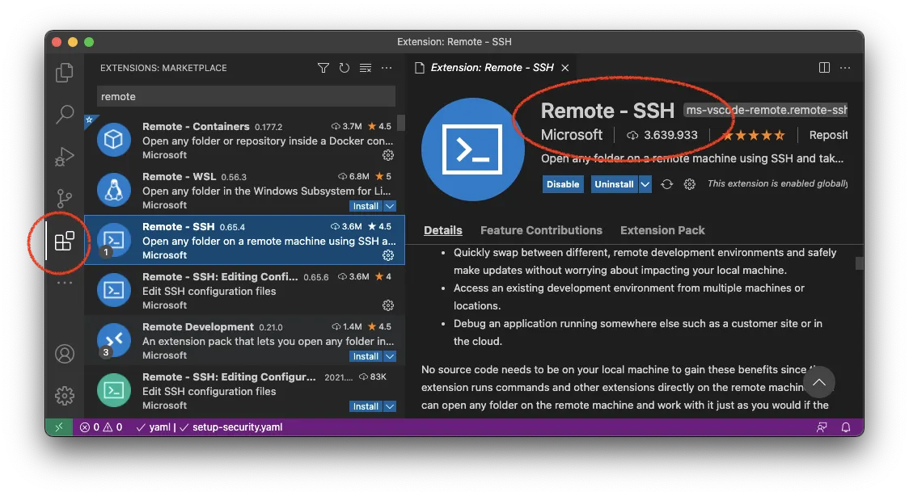

## Connecting via SSH

1. Download VS Code https://code.visualstudio.com/
2. Download the extension "Remote - SSH" from Microsoft.

    

3. A new Remote Explorer icon should have appeared on the left side. If you click on it you will see all SSH connections that are stored in the SSH config file (`~/.ssh/config`). Connect to them via the arrow symbol.

    

4. Use the folder symbol to explore a specific folder on the connected node.

    
